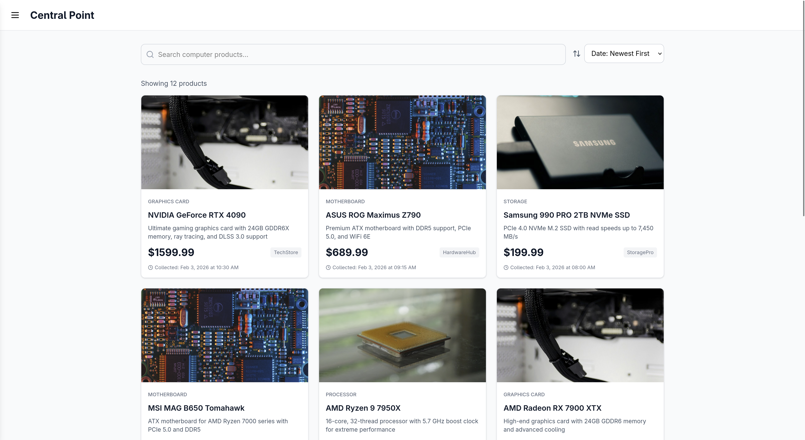

# central_point!

### Installation and Setup

1. **Clone the Repository**
   ```bash
   git clone https://github.com/SentinelMurphy/AI-Project-Forge.git
   cd AI-Project-Forge/Forge_Projects/Central_Point
   ```

2. **Install Dependencies**
   ```bash
   npm install
   ```

3. **Build the Application**
   ```bash
   npm run build
   ```

4. **Launch the Development Server**
   ```bash
   npm run dev
   ```

5. **Access the Application**
   Open your browser and navigate to: `http://localhost:5173`




