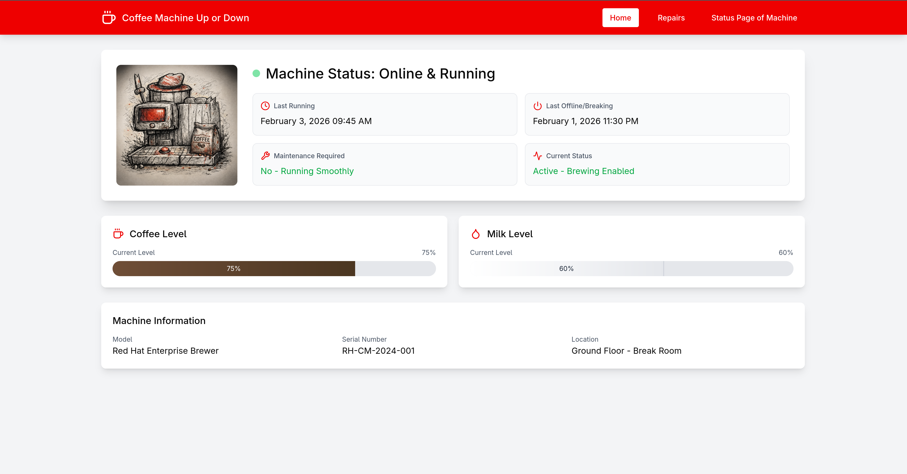
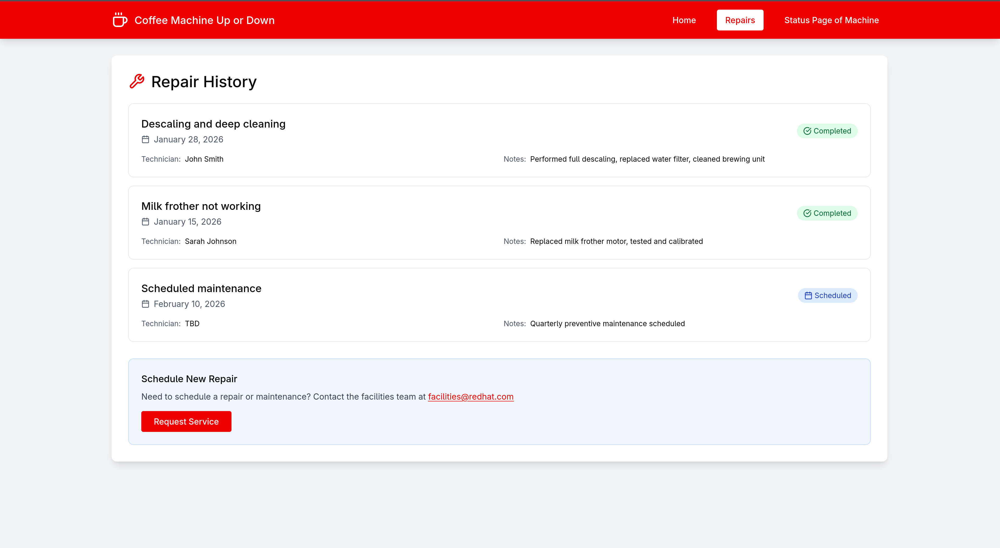
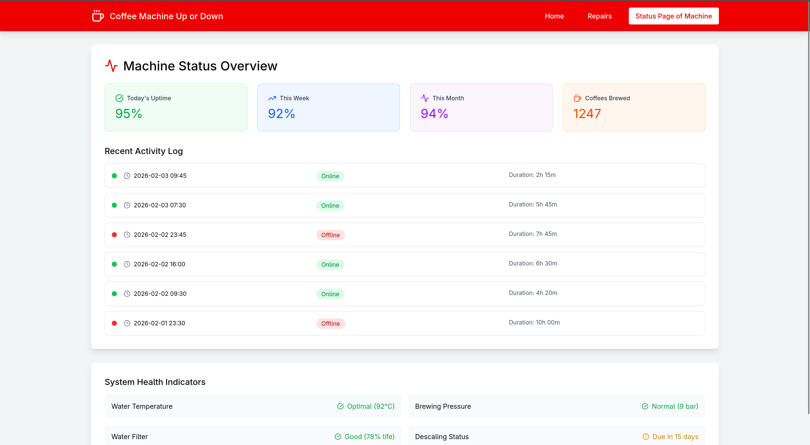

# CoffeeMachineUporDown 

## Overview
CoffeeMachineUporDown is a web application that monitors and displays the status of your
coffee machine, providing real-time information about its operation, maintenance history, and
system health.

## Quick Start

### Prerequisites
- Node.js (v22 or higher)
- npm (Node Package Manager)

### Installation & Running the Application

1. **Clone the Repository**
   ```bash
   git clone https://github.com/SentinelMurphy/AI-Project-Forge.git
   cd AI-Project-Forge/Forge_Projects/CoffeeMachineUpORDown
   ```

2. **Install Dependencies**
   ```bash
   npm install
   ```

3. **Build the Application**
   ```bash
   npm run build
   ```

4. **Start the Development Server**
   ```bash
   npm run dev
   ```

5. **Access the Application**
   Open your web browser and navigate to:
   ```
   http://localhost:5173
   ```

## Application Features

### Navigation Bar
The top navigation bar provides access to three main pages:
- **Home**: Main dashboard with status overview
- **Repairs**: Maintenance and repair history
- **Status Page**: Detailed machine information and system health

### Home Page
- **Status Section**: Displays current coffee machine status including:
    - Last Offline Time
    - Last Running Time
    - Current operational levels (water, beans, etc.)
    - Overall machine status

### Repairs Page
- **Repair History**: Comprehensive log of all maintenance activities
- Past repair records with dates and details
- Maintenance scheduling information

### Status Page
- **Full Machine Breakdown**: Detailed information about all coffee machine components
- **System Health Indicators**: Visual indicators showing the health status of various systems
- Real-time metrics and performance data






