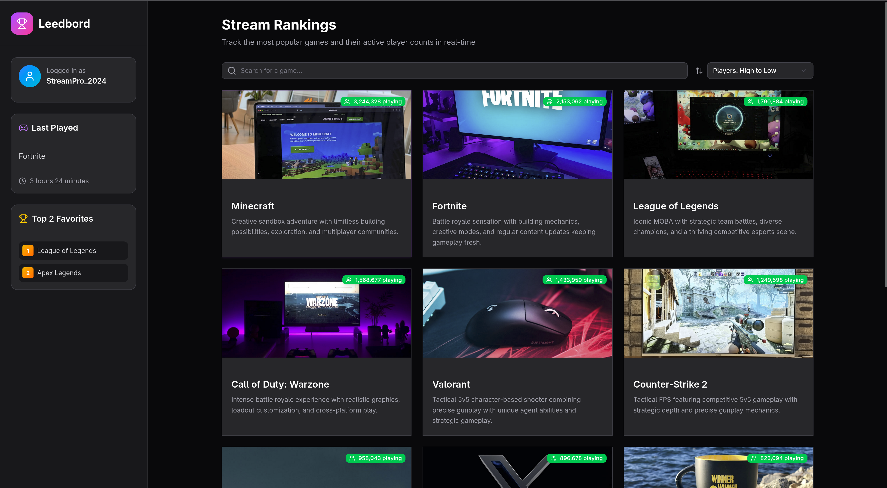
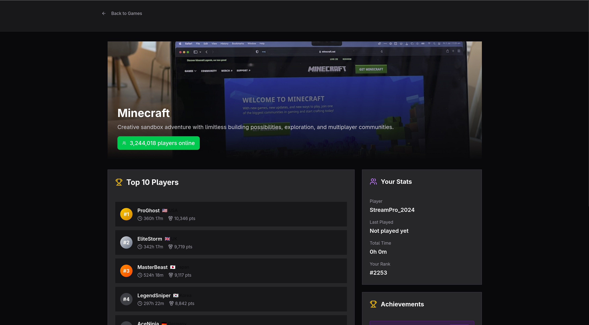

# Leedbord Setup and Usage Guide

Leedbord is a gaming leaderboard application that displays game
statistics, player rankings, and user information in an intuitive
interface.

### Installation and Setup

1. **Clone the Repository**
   ```bash
   git clone https://github.com/SentinelMurphy/AI-Project-Forge.git
   cd AI-Project-Forge/Forge_Projects/Leedbord
   ```

2. **Install Dependencies**
   ```bash
   npm install
   ```

3. **Build the Application**
   ```bash
   npm run build
   ```

4. **Launch the Development Server**
   ```bash
   npm run dev
   ```

5. **Access the Application**
   Open your browser and navigate to: `http://localhost:5173`

### Application Overview

**Note:** The application currently displays sample/fake data for
demonstration purposes.

#### Main Interface Components

1. **User Side Panel (Left Section)**
    - User login information
    - Last played game statistics
    - Top favorite games played by the user

2. **Main Content Area**
    - Search functionality to find specific games
    - Sort by options to organize game listings
    - Game cards displaying:
        - Game artwork and title
        - Game description
        - Current players in each game

#### Game Details Page

When you click on any game card, you'll be taken to a detailed view with:

- Comprehensive game information
- Top players currently playing the game
- Player locations
- "Your Stats" section showing:
    - User-specific statistics for the selected game
    - Last played date and time
    - Current ranking for that game

### Navigation Tips

- Use the search bar to quickly find specific games
- Utilize sort options to organize games by popularity, recent activity,
  or other criteria
- Click on user profiles in the leaderboard to see detailed player
  information
- The side panel provides quick access to your personal gaming statistics




