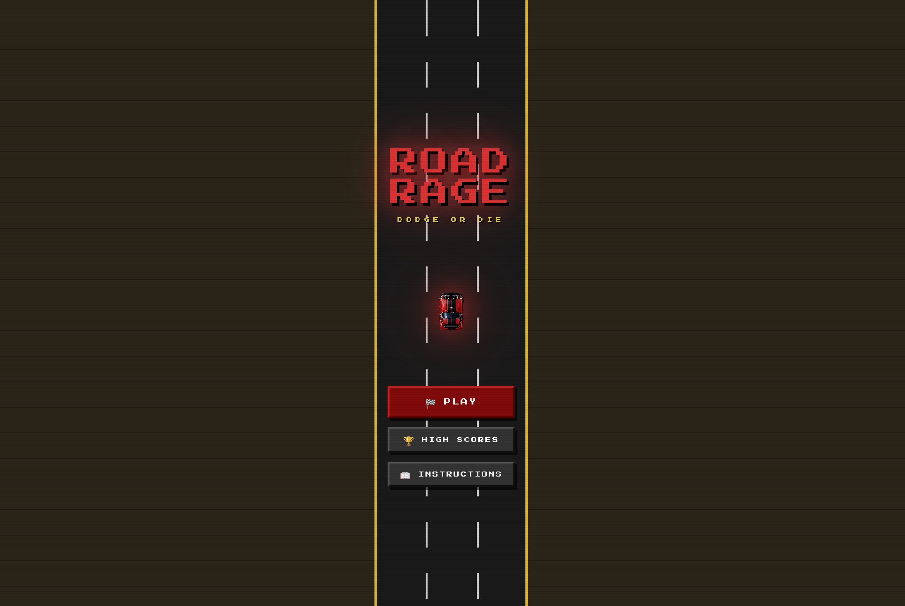

# Road Rage

A pixel-art / retro arcade racing game built with **React**, **TypeScript**, and **SCSS**. Inspired by Pixel Car Racer — top-down view, three lanes, enemy traffic, and a time-survival scoring system. The game scales to fill any screen size automatically.

---



---

## Table of Contents

1. [Tech Stack](#tech-stack)
2. [Project Structure](#project-structure)
3. [How the Source Code Works](#how-the-source-code-works)
    - [Entry Point](#entry-point)
    - [Routing](#routing)
    - [Pages](#pages)
    - [Components](#components)
    - [Utilities](#utilities)
    - [Styles](#styles)
4. [Game Mechanics Explained](#game-mechanics-explained)
5. [Controls](#controls)
6. [Score System](#score-system)
7. [How to Run Locally](#how-to-run-locally)
8. [Customisation Guide](#customisation-guide)

---

## Tech Stack

| Layer | Technology |
|---|---|
| UI Framework | React 18 (functional components + hooks) |
| Language | TypeScript |
| Routing | react-router (Data mode / `createBrowserRouter`) |
| Styling | SCSS Modules (no Tailwind used in game logic) |
| Font | Press Start 2P (Google Fonts — pixel aesthetic) |
| Car graphics | Inline SVG (enemies) · PNG asset (player) |
| Persistence | `localStorage` (scores only — no backend) |

---

## Project Structure

```
/
├── src/
│   ├── app/
│   │   ├── App.tsx                     # Root component — mounts RouterProvider
│   │   ├── routes.ts                   # All client-side routes
│   │   ├── pages/
│   │   │   ├── Landing.tsx             # Home / menu screen
│   │   │   ├── Game.tsx                # Main game loop + rendering
│   │   │   ├── HighScores.tsx          # Leaderboard table
│   │   │   └── Instructions.tsx        # How-to-play screen
│   │   ├── components/
│   │   │   ├── cars/
│   │   │   │   ├── PlayerCar.tsx       # Player PNG image component
│   │   │   │   └── EnemyCar.tsx        # Enemy inline-SVG component
│   │   │   
│   │   └── utils/
│   │       └── scores.ts               # localStorage score helpers
│   └── styles/
│       ├── variables.scss              # Design tokens (colours, sizes, fonts)
│       ├── global.scss                 # CSS reset + body defaults
│       ├── fonts.css                   # Google Fonts @import
│       ├── game.scss                   # Game page styles + keyframe animations
│       ├── landing.scss                # Landing page styles + keyframe animations
│       ├── highscores.scss             # High Scores page styles
│       └── instructions.scss          # Instructions page styles
└── README.md
```

---

## How the Source Code Works

### Entry Point

**`src/app/App.tsx`**

The root of the React tree. Its only job is to mount the router:

```tsx
import { RouterProvider } from 'react-router';
import { router } from './routes';

export default function App() {
  return <RouterProvider router={router} />;
}
```

It also imports the two global stylesheets — `fonts.css` (loads the Press Start 2P font) and `global.scss` (CSS reset, `image-rendering: pixelated` for crisp pixel art).

---

### Routing

**`src/app/routes.ts`**

Uses React Router's `createBrowserRouter` (Data mode). Four flat routes — no nested layouts:

```
/               → Landing.tsx
/game           → Game.tsx
/high-scores    → HighScores.tsx
/instructions   → Instructions.tsx
```

Navigation between pages uses the `useNavigate()` hook (e.g. `navigate('/game')`). There is no persistent shell or layout wrapper; each page is fully self-contained.

---

### Pages

#### `Landing.tsx`

The main menu screen. Key responsibilities:

- **Stars background** — 80 `<div>` elements are generated once via `useMemo` with random `x`, `y`, `size`, `animationDuration`, and `animationDelay` values. CSS drives the `star-twinkle` opacity animation.
- **Scrolling road strip** — a pure-CSS background using `repeating-linear-gradient` to draw dashed white lane dividers, animated with `road-scroll` keyframes.
- **Hero car** — the player PNG rendered large (130×210 px) with a red `drop-shadow` glow and a floating `car-float` CSS animation.
- **Navigation buttons** — three `<button>` elements that call `navigate()` to reach `/game`, `/high-scores`, or `/instructions`.

---

#### `Game.tsx`

The core of the application. This file contains the entire game loop. Here is how it is structured:

##### Constants (top of file)

```ts
const GAME_H   = 640;      // internal canvas height in px
const ROAD_X   = 60;       // road left edge (sidewalk width)
const ROAD_W   = 240;      // road width
const LANE_W   = 80;       // width of one lane (ROAD_W / 3)
const LC       = [100, 180, 260]; // lane centre x-coordinates
const CAR_W    = 36;       // enemy car width
const CAR_H    = 60;       // enemy car height
const P_W      = 64;       // player car hitbox width
const P_H      = 106;      // player car hitbox height
const PLAYER_Y = 482;      // player car top-edge y (near bottom)
```

These constants define the entire coordinate system. The game frame is always **360 × 640 px** internally regardless of screen size.

##### Viewport Scaling

```ts
const [gameScale, setGameScale] = useState(1);

useEffect(() => {
  const update = () => {
    setGameScale(Math.min(
      window.innerWidth  / 360,
      window.innerHeight / 640
    ));
  };
  update();
  window.addEventListener('resize', update);
}, []);
```

`transform: scale(gameScale)` is applied to the `.game-frame` div. The internal 360×640 coordinate system never changes — only the visual size does. `Math.min` ensures the game fits entirely on screen (letterbox / contain behaviour).

##### Game State

Two types of state are used deliberately:

- **`gameRef` (useRef)** — holds mutable `GameData` that changes every animation frame. Using a ref avoids triggering React re-renders on every frame tick.
- **`useState`** — used only for values that should cause a re-render: `phase`, `countdown`, `finalScore`, `gameScale`.
- **`useReducer(n => n+1, 0)`** — a lightweight force-render trigger called once per frame inside the game loop to paint the updated positions.

##### The Game Loop (`startLoop`)

Powered by `requestAnimationFrame`. Each frame:

1. **Delta time** (`dt`) is calculated from `performance.now()` and capped at 50 ms to prevent teleportation after tab switches.
2. **Score** increments by `dt` (time survived in seconds).
3. **Speed** grows linearly: `BASE_SPEED + score × SPEED_GROW`, capped at `MAX_SPEED`.
4. **Player X** smoothly interpolates toward the target lane centre at `LANE_ANIM px/s`.
5. **Road offset** advances, driving the scrolling dash-line CSS `backgroundPositionY`.
6. **Spawn timer** counts down; when it fires, a random lane (excluding recently spawned lanes) gets a new enemy with a random `EnemyType`.
7. **All enemies** move downward by `speed × dt` pixels and are removed once they scroll off the bottom.
8. **Collision detection** — axis-aligned bounding box (AABB) check with an 8 px inset on the player and 5 px inset on each enemy to make the hitbox slightly forgiving.
9. On a hit → `saveScore`, set `phase = 'gameover'`, stop the loop.

##### Phase State Machine

```
countdown → playing → paused → playing
                    ↘ gameover → (restart → countdown)
```

- `countdown` — a `setInterval` counts 3 → 2 → 1 → GO, then calls `startLoop`.
- `playing` — loop is running; keyboard input changes `playerLane`.
- `paused` — loop is cancelled; P/ESC resumes.
- `gameover` — loop stopped; overlay shown with final score.

##### Keyboard Handling

A `keydown` listener on `window` reads from `phaseRef.current` (not `phase` state) to avoid stale closure issues.

| Key | Action |
|---|---|
| `ArrowLeft` / `A` | Move player one lane left |
| `ArrowRight` / `D` | Move player one lane right |
| `P` / `Escape` | Toggle pause |

##### Lean Effect

```ts
const lean = playerX < LC[playerLane] - 2 ? -7
           : playerX > LC[playerLane] + 2 ?  7
           : 0;
```

While the car is mid-animation between lanes, `lean` is ±7 degrees, passed to `<PlayerCar>` as a prop to tilt the car visually.

---

#### `HighScores.tsx`

Reads the top-10 score list from `localStorage` via `getAllScores()` on mount. Renders a table with gold/silver/bronze medal styling for the top three entries. A "Clear Scores" button wipes both `localStorage` keys and resets local state to an empty array.

---

#### `Instructions.tsx`

Fully static content screen. Renders:
- **Controls** — keyboard key visual components built from plain `<span>` elements.
- **Tips** — four gameplay hints.
- **Enemy gallery** — maps over the `ENEMIES` array and renders each `<EnemyCar>` SVG alongside its name label.

---

### Components

#### `PlayerCar.tsx` — `src/app/components/cars/PlayerCar.tsx`

Renders the player's PNG car image.

```tsx
export const PLAYER_CAR_W = 64;
export const PLAYER_CAR_H = 106;
```

These exported constants are imported by `Game.tsx` so the hitbox width/height exactly matches the rendered image size. The image uses `object-fit: cover` + `object-position: center` — this crops the PNG from the centre outward, removing any transparent or white padding in the source file so the car body always fills the full 64×106 box. `rotate(180deg)` faces the car up the road. A red `drop-shadow` filter creates the glow effect.

---

#### `EnemyCar.tsx` — `src/app/components/cars/EnemyCar.tsx`

Renders a 36×60 px inline SVG car in one of five colour palettes:

| Type | Colour | Special |
|---|---|---|
| `blue` | Blue sedan | — |
| `yellow` | Yellow taxi | Checker stripe + roof sign |
| `police` | Grey/white | Red+blue light bar |
| `green` | Green SUV | — |
| `orange` | Orange muscle | — |

The SVG is hand-coded with `<rect>` elements: body, hood, windshield, roof, rear window, trunk, bumpers, headlights, tail lights, and four wheels. Police and taxi types render extra `<rect>` elements conditionally.

---

### Utilities

#### `scores.ts` — `src/app/utils/scores.ts`

Pure functions — no React. All data lives in `localStorage` under two keys:

| Key | Value |
|---|---|
| `roadrage_scores` | JSON array of `{ score: number, date: string }`, max 10 entries, sorted descending |
| `roadrage_last` | Plain string — the most recent score only |

| Export | Description |
|---|---|
| `saveScore(n)` | Appends entry, re-sorts, slices to 10, writes both keys |
| `getAllScores()` | Returns the full sorted array |
| `getBestScore()` | Returns `entries[0].score` or `0` |
| `getLastScore()` | Returns the `roadrage_last` value or `0` |

---

### Styles

All SCSS files use `@use 'variables' as *` to access the shared design tokens.

#### `variables.scss` — Design Tokens

The single source of truth for all visual values. Changing a value here affects the entire app.

```scss
// Colours
$bg-deep:     #07070f;   // page background
$road-color:  #1a1a1a;   // tarmac
$sidewalk:    #2d2418;   // kerb / pavement
$red-primary: #e01c1c;   // UI accent red
$gold:        #ffd700;   // score / medal gold

// Typography
$font-pixel: 'Press Start 2P', monospace;

// Game dimensions
$game-w:  360px;
$game-h:  640px;
$road-x:  60px;    // sidewalk width on each side
$road-w:  240px;   // total road width
$lane-w:  80px;    // single lane width
```

#### `global.scss`

CSS reset (`box-sizing`, `margin`, `padding`). Sets `image-rendering: pixelated` globally for crisp scaling of pixel-art assets. Disables font smoothing to preserve the blocky pixel font appearance.

#### `fonts.css`

Single `@import` for the **Press Start 2P** font from Google Fonts. Imported once in `App.tsx` — applies globally.

#### `game.scss`

Styles for the game page. Key sections:

- **`.game-page`** — `100vw × 100vh`, flex-centred, black background. `::after` pseudo-element creates the CRT scanline overlay using `repeating-linear-gradient`.
- **`.game-frame`** — fixed `360×640 px` layout box. `transform-origin: center center` ensures JS `scale()` expands from the middle. `overflow: hidden` clips cars that scroll off the road.
- **`.car-wrap`** — `position: absolute` wrapper for every car (enemy and player). `z-index: 5` places cars above the road layer.
- **`.dash-layer`** / **`.road-layer`** — purely decorative. The dashes animate via `backgroundPositionY` driven by the JS game loop value.
- **Overlay classes** — `.overlay-countdown`, `.overlay-pause`, `.overlay-gameover` all use `position: absolute; inset: 0` to cover the game frame in-place without a route change.
- **Keyframe animations** — `crash-shake` (game-over wobble), `countdown-pop`, `go-pop`, `score-pulse`, `flicker`, `scanlines`.

#### `landing.scss`

- **`.stars-layer`** — absolutely positioned star `<div>` elements animated by `star-twinkle`.
- **`.landing-road-bg`** — centred 240 px wide strip with scrolling dashes (`road-scroll` keyframes, CSS-only).
- **`.landing-car`** — wrapper for the hero PNG. `car-float` keyframes make it bob up and down.
- **`.menu-btn`** — pixel-art button style with a 3-D box-shadow offset and hover lift effect. `.secondary` variant uses grey instead of red.

#### `highscores.scss` / `instructions.scss`

Identical page layout pattern: `100vw × 100vh` centred flex container with a `360 px` wide floating panel (matching the game frame width for visual consistency). `row-in` keyframes stagger score rows sliding in from the left.

---

## Game Mechanics Explained

| Mechanic | Detail |
|---|---|
| **Scoring** | Time survived in whole seconds. Every second alive = +1 point. |
| **Speed progression** | Starts at 100 px/s. Grows by 10 px/s for every second survived. Capped at 620 px/s. |
| **Spawn rate** | Starts at one enemy every 2 000 ms. Decreases by 22 ms per second survived. Floor is 450 ms. |
| **Lane blocking** | If a lane already has an enemy within 30 px of the top, it is excluded from the next spawn. |
| **Collision** | AABB (axis-aligned bounding box). Player hitbox is inset 8 px from the image edges. Enemy hitbox is inset 5 px. One hit ends the game immediately. |
| **High scores** | Top 10 all-time scores stored in `localStorage`. Persists across page reloads. |

---

## Controls

| Key | Action |
|---|---|
| `←` Arrow / `A` | Switch one lane to the left |
| `→` Arrow / `D` | Switch one lane to the right |
| `P` | Pause / Resume |
| `Escape` | Pause / Resume |

---

## Score Systemimport { createBrowserRouter } from 'react-router';
import Landing      from './pages/Landing';
import Game         from './pages/Game';
import HighScores   from './pages/HighScores';
import Instructions from './pages/Instructions';

export const router = createBrowserRouter([
    { path: '/',             Component: Landing      },
    { path: '/game',         Component: Game         },
    { path: '/high-scores',  Component: HighScores   },
    { path: '/instructions', Component: Instructions },
]);


Scores are saved automatically when the player crashes. The leaderboard stores up to **10 entries** sorted by score descending. The game HUD shows both the current **best** and the **last** run score at all times.

To reset all scores: open the **High Scores** page and click **CLEAR SCORES**.

---

## How to Run Locally

```bash
# Install dependencies
npm install

# Start dev server
npm dev

# Build for production
npm build
```

The dev server opens at `http://localhost:5173` by default (Vite). No environment variables or backend required — the game is entirely client-side.

---

## Customisation Guide

### Change game speed or difficulty

Edit the constants at the top of `src/app/pages/Game.tsx`:

```ts
const BASE_SPEED  = 100;   // starting px/s — raise to make it harder immediately
const SPEED_GROW  = 10;    // px/s added per second survived
const MAX_SPEED   = 620;   // absolute speed ceiling
const SPAWN_START = 2000;  // ms between first enemy spawns
const SPAWN_MIN   = 450;   // minimum spawn interval (hardest)
const SPAWN_DECAY = 22;    // ms removed per second (higher = faster ramp-up)
```

### Change road / lane layout

Edit `variables.scss` tokens and keep the JS constants in sync:

```scss
$road-x: 60px;   // sidewalk width
$road-w: 240px;  // total tarmac width
$lane-w: 80px;   // one lane ($road-w / 3)
```

The matching JS constants in `Game.tsx` must be updated too:
```ts
const ROAD_X = 60;
const ROAD_W = 240;
```

### Add a new enemy type

1. Add the new type string to the `EnemyType` union in `EnemyCar.tsx`.
2. Add a colour entry to the `PALETTE` object.
3. Draw any special SVG elements inside a conditional block.
4. Add the type to the `ENEMY_TYPES` array in `Game.tsx` — it will be picked randomly.

### Swap the player car image

Replace the asset import in `PlayerCar.tsx`:

```ts
import playerCarImg from 'asset/YOUR_ASSET_ID.png';
```

If the new image has different proportions, adjust `PLAYER_CAR_W` / `PLAYER_CAR_H` and update `PLAYER_Y` in `Game.tsx` to reposition the car near the bottom of the road.

### Change colours / fonts

All visual design tokens live in `src/styles/variables.scss`. Change `$red-primary`, `$gold`, `$road-color`, etc. and the whole app updates automatically — no component changes needed.

---

## ./App.tsx Code
```tsx
import { RouterProvider } from 'react-router';
import { router } from './routes';
import '../styles/fonts.css';
import '../styles/global.scss';

export default function App() {
    return <RouterProvider router={router} />;
}
```

---
## ./routes.ts Code
```tsx
import { createBrowserRouter } from 'react-router';
import Landing      from './pages/Landing';
import Game         from './pages/Game';
import HighScores   from './pages/HighScores';
import Instructions from './pages/Instructions';

export const router = createBrowserRouter([
    { path: '/',             Component: Landing      },
    { path: '/game',         Component: Game         },
    { path: '/high-scores',  Component: HighScores   },
    { path: '/instructions', Component: Instructions },
]);

```
---
## ./components/cars/EnemyCar.tsx Code
```tsx
export type EnemyType = 'blue' | 'yellow' | 'police' | 'green' | 'orange';

interface Colors {
   body:  string;
   dark:  string;
   light: string;
   roof:  string;
}

const PALETTE: Record<EnemyType, Colors> = {
   blue:   { body: '#1155cc', dark: '#0a3a99', light: '#4488ee', roof: '#0a3a99' },
   yellow: { body: '#e8b820', dark: '#b89010', light: '#f8d040', roof: '#b89010' },
   police: { body: '#dddddd', dark: '#888888', light: '#eeeeee', roof: '#222222' },
   green:  { body: '#1a7a20', dark: '#0e5214', light: '#2eaa34', roof: '#0e5214' },
   orange: { body: '#dd5500', dark: '#aa3300', light: '#ff7722', roof: '#aa3300' },
};

interface EnemyCarProps {
   type: EnemyType;
}

export function EnemyCar({ type }: EnemyCarProps) {
   const c = PALETTE[type];

   return (
           <svg
                   viewBox="0 0 36 60"
                   width="36"
                   height="60"
                   xmlns="http://www.w3.org/2000/svg"
                   style={{ display: 'block' }}
           >
              {/* Body shadow */}
              <rect x="3" y="6" width="30" height="48" rx="5" fill={c.dark} />
              {/* Main body */}
              <rect x="5" y="8" width="26" height="44" rx="4" fill={c.body} />
              {/* Hood */}
              <rect x="7" y="8" width="22" height="11" rx="3" fill={c.light} />
              {/* Front windshield */}
              <rect x="9" y="11" width="18" height="9" rx="2" fill="#88bbee" opacity="0.85" />
              {/* Windshield glare */}
              <rect x="10" y="12" width="5" height="4" rx="1" fill="#ffffff" opacity="0.3" />
              {/* Roof */}
              <rect x="9" y="20" width="18" height="11" rx="1" fill={c.roof} />
              {/* Rear windshield */}
              <rect x="9" y="31" width="18" height="8" rx="2" fill="#88bbee" opacity="0.8" />
              {/* Trunk */}
              <rect x="7" y="39" width="22" height="12" rx="3" fill={c.light} />
              {/* Front bumper */}
              <rect x="10" y="5" width="16" height="5" rx="2" fill="#555" />
              {/* Rear bumper */}
              <rect x="10" y="51" width="16" height="5" rx="2" fill="#555" />
              {/* Headlights */}
              <rect x="8"  y="5" width="8" height="4" rx="1" fill="#ffee88" />
              <rect x="20" y="5" width="8" height="4" rx="1" fill="#ffee88" />
              {/* Tail lights */}
              <rect x="8"  y="52" width="8" height="4" rx="1" fill="#ff3333" />
              <rect x="20" y="52" width="8" height="4" rx="1" fill="#ff3333" />
              {/* Wheels */}
              <rect x="0"  y="9"  width="5" height="12" rx="2" fill="#111" />
              <rect x="1"  y="10" width="3" height="10" rx="1" fill="#333" />
              <rect x="31" y="9"  width="5" height="12" rx="2" fill="#111" />
              <rect x="32" y="10" width="3" height="10" rx="1" fill="#333" />
              <rect x="0"  y="39" width="5" height="12" rx="2" fill="#111" />
              <rect x="1"  y="40" width="3" height="10" rx="1" fill="#333" />
              <rect x="31" y="39" width="5" height="12" rx="2" fill="#111" />
              <rect x="32" y="40" width="3" height="10" rx="1" fill="#333" />

              {/* ── Police special: light bar + stripe ──────────────────── */}
              {type === 'police' && (
                      <>
                         <rec x="10" y="19" width="16" height="5" rx="1" fill="#111" />
                         <rect x="10" y="20" width="7"  height="3" rx="1" fill="#ff2222" />
                         <rect x="19" y="20" width="7"  height="3" rx="1" fill="#2222ff" />
                         <rect x="5"  y="28" width="26" height="3" fill="#111" />
                      </>
              )}

              {/* ── Taxi special: checker stripe + roof sign ─────────────── */}
              {type === 'yellow' && (
                      <>
                         {/* Checker stripe */}
                         {[0,1,2,3,4,5].map(i => (
                                 <rect key={i} x={5 + i * 4} y="26" width="4" height="4"
                                       fill={i % 2 === 0 ? '#111' : '#e8b820'} />
                         ))}
                         {/* Roof sign */}
                         <rect x="11" y="21" width="14" height="6" rx="1" fill="#ffd700" />
                         <rect x="13" y="22" width="10" height="4" rx="1" fill="#111" />
                      </>
              )}
           </svg>
   );
}


```
---
## ./components/cars/PlayerCar.tsx Code
```tsx

import playerCarImg from '../../assets/player_car.png';

interface PlayerCarProps {
    lean?: number;
}

export const PLAYER_CAR_W = 64;
export const PLAYER_CAR_H = 106;

export function PlayerCar({ lean = 0 }: PlayerCarProps) {
    return (
        
    );
}

```

---
## ./pages/Game.tsx Code
```tsx

import { PlayerCar, PLAYER_CAR_W, PLAYER_CAR_H } from '../components/cars/PlayerCar';
import {
    useRef,
    useState,
    useEffect,
    useCallback,
    useReducer,
} from 'react';
import { useNavigate } from 'react-router';
import { EnemyCar } from '../components/cars/EnemyCar';
import type { EnemyType } from '../components/cars/EnemyCar';
import { saveScore, getBestScore, getLastScore } from '../utils/scores';
import '../../styles/game.scss';

// ── Constants ────────────────────────────────────────────────────────────────
const GAME_H      = 640;
const ROAD_X      = 60;
const ROAD_W      = 240;
const LANES       = 3;
const LANE_W      = ROAD_W / LANES; // 80
// Lane centers (absolute x)
const LC          = [ROAD_X + LANE_W * 0.5, ROAD_X + LANE_W * 1.5, ROAD_X + LANE_W * 2.5]; // [100,180,260]
const CAR_W       = 36;
const CAR_H       = 60;
const P_W         = PLAYER_CAR_W;   // 64 – 80 % of lane width
const P_H         = PLAYER_CAR_H;   // 106
const PLAYER_Y    = GAME_H - P_H - 52;   // 482 – near bottom with a small gap
const BASE_SPEED  = 100;  // px/s
const SPEED_GROW  = 10;   // px/s per second survived
const MAX_SPEED   = 620;
const LANE_ANIM   = 500;  // px/s lane-change animation
const DASH_CYCLE  = 80;   // px per dash+gap repeat
const SPAWN_START = 2000; // ms initial spawn interval
const SPAWN_MIN   = 450;  // ms minimum spawn interval
const SPAWN_DECAY = 22;   // ms reduction per second survived

const ENEMY_TYPES: EnemyType[] = ['blue', 'yellow', 'police', 'green', 'orange'];

interface Enemy {
    id: number;
    lane: number;
    y: number;
    type: EnemyType;
}

interface GameData {
    score: number;
    speed: number;
    playerLane: number;
    playerX: number;
    enemies: Enemy[];
    roadOffset: number;
    spawnTimer: number;
    lastTime: number;
    nextId: number;
}

type Phase = 'countdown' | 'playing' | 'paused' | 'gameover';

function makeGameData(): GameData {
    return {
        score: 0,
        speed: BASE_SPEED,
        playerLane: 1,
        playerX: LC[1],
        enemies: [],
        roadOffset: 0,
        spawnTimer: SPAWN_START,
        lastTime: 0,
        nextId: 0,
    };
}

export default function Game() {
    const navigate    = useNavigate();
    const rafRef      = useRef(0);
    const phaseRef    = useRef<Phase>('countdown');
    const gameRef     = useRef<GameData>(makeGameData());
    const crashRef    = useRef(false);
    const [phase, setPhaseState] = useState<Phase>('countdown');
    const [countdown, setCountdown] = useState(3);
    const [showGo, setShowGo] = useState(false);
    const [bestScore] = useState(getBestScore);
    const [lastScore] = useState(getLastScore);
    const [finalScore, setFinalScore] = useState(0);
    const [newBest, setNewBest] = useState(false);
    const [, render] = useReducer(n => n + 1, 0);

    // ── Scale game frame to fill the full viewport ──────────────────────────
    const [gameScale, setGameScale] = useState(1);
    useEffect(() => {
        const GAME_W = 360;
        const update = () => {
            const sx = window.innerWidth  / GAME_W;
            const sy = window.innerHeight / GAME_H;
            setGameScale(Math.min(sx, sy));
        };
        update();
        window.addEventListener('resize', update);
        return () => window.removeEventListener('resize', update);
    }, []);

    const setPhase = useCallback((p: Phase) => {
        phaseRef.current = p;
        setPhaseState(p);
    }, []);

    // ── Game loop ───────────────────────────────────────────────────────────
    const startLoop = useCallback(() => {
        const s = gameRef.current;
        s.lastTime = performance.now();

        const loop = (ts: number) => {
            const g = gameRef.current;
            const dt = Math.min((ts - g.lastTime) / 1000, 0.05);
            g.lastTime = ts;

            // Score (time-based)
            g.score += dt;

            // Speed
            g.speed = Math.min(BASE_SPEED + g.score * SPEED_GROW, MAX_SPEED);

            // Smooth lane animation
            const tx = LC[g.playerLane];
            const dx = tx - g.playerX;
            const step = LANE_ANIM * dt;
            g.playerX = Math.abs(dx) <= step ? tx : g.playerX + Math.sign(dx) * step;

            // Road scroll (background-position-y driven by JS)
            g.roadOffset = (g.roadOffset + g.speed * dt) % DASH_CYCLE;

            // Spawn
            g.spawnTimer -= dt * 1000;
            if (g.spawnTimer <= 0) {
                const interval = Math.max(SPAWN_MIN, SPAWN_START - g.score * SPAWN_DECAY);
                g.spawnTimer = interval;

                const occupied = g.enemies.filter(e => e.y < CAR_H + 30).map(e => e.lane);
                const avail = [0, 1, 2].filter(l => !occupied.includes(l));

                if (avail.length > 0) {
                    const lane = avail[Math.floor(Math.random() * avail.length)];
                    const type = ENEMY_TYPES[Math.floor(Math.random() * ENEMY_TYPES.length)];
                    g.enemies.push({ id: g.nextId++, lane, y: -CAR_H - 10, type });
                }
            }

            // Move enemies
            for (let i = 0; i < g.enemies.length; i++) {
                g.enemies[i] = { ...g.enemies[i], y: g.enemies[i].y + g.speed * dt };
            }
            g.enemies = g.enemies.filter(e => e.y < GAME_H + CAR_H);

            // Collision – inset 8 px each side so bumps feel fair
            const pL = g.playerX - P_W / 2 + 8;
            const pR = g.playerX + P_W / 2 - 8;
            const pT = PLAYER_Y + 14;
            const pB = PLAYER_Y + P_H - 14;

            let hit = false;
            for (const e of g.enemies) {
                const ex = LC[e.lane];
                const eL = ex - CAR_W / 2 + 5;
                const eR = ex + CAR_W / 2 - 5;
                const eT = e.y + 8;
                const eB = e.y + CAR_H - 8;
                if (pR > eL && pL < eR && pB > eT && pT < eB) { hit = true; break; }
            }

            if (hit) {
                const score = Math.floor(g.score);
                saveScore(score);
                const prev = getBestScore();
                setFinalScore(score);
                setNewBest(score >= prev);
                crashRef.current = true;
                setPhase('gameover');
                render();
                return; // don't reschedule
            }

            render();
            rafRef.current = requestAnimationFrame(loop);
        };

        rafRef.current = requestAnimationFrame(loop);
    }, [setPhase]);

    // ── Countdown ────────────────────────────────────────────────────────────
    const runCountdown = useCallback(() => {
        let c = 3;
        setCountdown(c);
        setShowGo(false);
        setPhase('countdown');

        const id = setInterval(() => {
            c--;
            if (c > 0) {
                setCountdown(c);
            } else {
                clearInterval(id);
                setShowGo(true);
                setTimeout(() => {
                    setShowGo(false);
                    setPhase('playing');
                    startLoop();
                }, 700);
            }
        }, 1000);

        return id;
    }, [setPhase, startLoop]);

    // ── Mount: start countdown ────────────────────────────────────────────────
    useEffect(() => {
        const id = runCountdown();
        return () => {
            clearInterval(id);
            cancelAnimationFrame(rafRef.current);
        };
        // eslint-disable-next-line react-hooks/exhaustive-deps
    }, []);

    // ── Keyboard ──────────────────────────────────────────────────────────────
    useEffect(() => {
        const onKey = (e: KeyboardEvent) => {
            if (e.repeat) return;
            const p = phaseRef.current;
            const g = gameRef.current;

            if (p === 'playing') {
                if (e.code === 'ArrowLeft'  || e.code === 'KeyA') {
                    g.playerLane = Math.max(0, g.playerLane - 1);
                }
                if (e.code === 'ArrowRight' || e.code === 'KeyD') {
                    g.playerLane = Math.min(LANES - 1, g.playerLane + 1);
                }
                if (e.code === 'KeyP' || e.code === 'Escape') {
                    cancelAnimationFrame(rafRef.current);
                    setPhase('paused');
                }
            } else if (p === 'paused') {
                if (e.code === 'KeyP' || e.code === 'Escape') {
                    gameRef.current.lastTime = performance.now();
                    startLoop();
                    setPhase('playing');
                }
            }
        };
        window.addEventListener('keydown', onKey);
        return () => window.removeEventListener('keydown', onKey);
    }, [setPhase, startLoop]);

    // ── Pause on tab hide ─────────────────────────────────────────────────────
    useEffect(() => {
        const onHide = () => {
            if (phaseRef.current === 'playing') {
                cancelAnimationFrame(rafRef.current);
                setPhase('paused');
            }
        };
        document.addEventListener('visibilitychange', onHide);
        return () => document.removeEventListener('visibilitychange', onHide);
    }, [setPhase]);

    // ── Restart ───────────────────────────────────────────────────────────────
    const handleRestart = useCallback(() => {
        cancelAnimationFrame(rafRef.current);
        crashRef.current = false;
        Object.assign(gameRef.current, makeGameData());
        runCountdown();
    }, [runCountdown]);

    // ── Pause/Resume buttons ──────────────────────────────────────────────────
    const handlePause = useCallback(() => {
        if (phaseRef.current === 'playing') {
            cancelAnimationFrame(rafRef.current);
            setPhase('paused');
        }
    }, [setPhase]);

    const handleResume = useCallback(() => {
        if (phaseRef.current === 'paused') {
            gameRef.current.lastTime = performance.now();
            startLoop();
            setPhase('playing');
        }
    }, [setPhase, startLoop]);

    // ── Render ────────────────────────────────────────────────────────────────
    const g = gameRef.current;
    const liveScore = Math.floor(g.score);
    const lean = g.playerX < LC[g.playerLane] - 2 ? -7 : g.playerX > LC[g.playerLane] + 2 ? 7 : 0;

    return (
        <div className="game-page">
            <div
                className="game-frame"
                style={{ transform: `scale(${gameScale})` }}
            >

                <div
                    className={`game-inner${crashRef.current && phase === 'gameover' ? ' crash-flash' : ''}`}
                    style={{ position: 'absolute', inset: 0 }}
                >
                    {/* ── Road layer ─────────────────────────────────────────────── */}
                    <div className="road-layer">
                        <div className="sidewalk left" />
                        <div className="road-surface" />
                        <div className="sidewalk right" />
                    </div>

                    {/* ── Scrolling dashes ───────────────────────────────────────── */}
                    <div className="dash-layer">
                        <div
                            className="dash-line d1"
                            style={{ backgroundPositionY: `${g.roadOffset}px` }}
                        />
                        <div
                            className="dash-line d2"
                            style={{ backgroundPositionY: `${g.roadOffset}px` }}
                        />
                    </div>

                    {/* ── Large faint score in road center ───────────────────────── */}
                    {phase === 'playing' && (
                        <div className="live-score-center">{liveScore}</div>
                    )}

                    {/* ── Enemy cars ─────────────────────────────────────────────── */}
                    {g.enemies.map(enemy => (
                        <div
                            key={enemy.id}
                            className="car-wrap"
                            style={{
                                left: LC[enemy.lane] - CAR_W / 2,
                                top: enemy.y,
                            }}
                        >
                            <EnemyCar type={enemy.type} />
                        </div>
                    ))}

                    {/* ── Player car ─────────────────────────────────────────────── */}
                    <div
                        className="car-wrap"
                        style={{
                            left: g.playerX - P_W / 2,
                            top: PLAYER_Y,
                        }}
                    >
                        <PlayerCar lean={lean} />
                    </div>

                    {/* ── HUD ────────────────────────────────────────────────────── */}
                    <div className="hud">
                        {phase === 'playing' && (
                            <button className="pause-btn" onClick={handlePause} title="Pause (P)">
                                ⏸
                            </button>
                        )}
                        {phase !== 'playing' && <div style={{ width: 38 }} />}

                        <div className="score-hud">
                            <div className="score-live">{liveScore}s</div>
                            <div className="score-sub">BEST&nbsp;<span>{bestScore}s</span></div>
                            <div className="score-sub">LAST&nbsp;<span>{lastScore}s</span></div>
                        </div>
                    </div>

                    {/* ── Countdown overlay ──────────────────────────────────────── */}
                    {phase === 'countdown' && (
                        <div className="overlay-countdown">
                            {showGo
                                ? <div key="go"    className="countdown-go">GO!</div>
                                : <div key={countdown} className="countdown-num">{countdown}</div>
                            }
                        </div>
                    )}

                    {/* ── Pause overlay ──────────────────────────────────────────── */}
                    {phase === 'paused' && (
                        <div className="overlay-pause">
                            <div className="pause-title">PAUSED</div>
                            <div className="pause-hint">
                                PRESS P or ESC TO RESUME<br />
                                ◀ ▶ / A D TO SWITCH LANES
                            </div>
                            <button className="pause-resume-btn" onClick={handleResume}>
                                ▶ RESUME
                            </button>
                        </div>
                    )}

                    {/* ── Game Over overlay ───────────────────────────────────────── */}
                    {phase === 'gameover' && (
                        <div className="overlay-gameover">
                            <div className="go-title">GAME OVER</div>

                            {newBest && (
                                <div className="go-new-record">★ NEW RECORD ★</div>
                            )}

                            <div className="go-scores">
                                <div className="go-score-row">
                                    <span className="go-label">TIME SURVIVED</span>
                                    <span className={`go-value${newBest ? ' new-best' : ''}`}>{finalScore}s</span>
                                </div>
                                <div className="go-score-row" style={{ width: '100%' }}>
                                    <div className="go-divider" style={{ width: '100%', height: 1, background: '#333', marginTop: 4, marginBottom: 4 }} />
                                </div>
                                <div className="go-score-row">
                                    <span className="go-label">BEST</span>
                                    <span className="go-value">{getBestScore()}s</span>
                                </div>
                                <div className="go-score-row">
                                    <span className="go-label">LAST</span>
                                    <span className="go-value">{getLastScore()}s</span>
                                </div>
                            </div>

                            <div className="go-buttons">
                                <button className="go-btn" onClick={() => navigate('/')}>
                                    <span className="go-btn-icon">🏠</span>
                                    HOME
                                </button>
                                <button className="go-btn" onClick={handleRestart}>
                                    <span className="go-btn-icon">🔄</span>
                                    REPLAY
                                </button>
                            </div>
                        </div>
                    )}
                </div>
            </div>
        </div>
    );
}

```

---
## ./pages/HighScores.tsx Code
```tsx
import { useState } from 'react';
import { useNavigate } from 'react-router';
import { getAllScores } from '../utils/scores';
import '../../styles/highscores.scss';

export default function HighScores() {
    const navigate = useNavigate();
    const [scores, setScores] = useState(() => getAllScores());

    const rankClass = (i: number) => {
        if (i === 0) return 'gold';
        if (i === 1) return 'silver';
        if (i === 2) return 'bronze';
        return '';
    };

    const rankLabel = (i: number) => {
        if (i === 0) return '🥇';
        if (i === 1) return '🥈';
        if (i === 2) return '🥉';
        return `#${i + 1}`;
    };

    const handleClear = () => {
        localStorage.removeItem('roadrage_scores');
        localStorage.removeItem('roadrage_last');
        setScores([]);
    };

    return (
        <div className="hs-page">
            <div className="hs-panel">
                <button className="hs-back" onClick={() => navigate('/')}>
                    BACK
                </button>

                <h1 className="hs-title">HIGH SCORES</h1>

                {scores.length === 0 ? (
                    <div className="hs-empty">
                        NO SCORES YET<br />
                        GET IN THE CAR<br />
                        AND DRIVE!
                    </div>
                ) : (
                    <table className="hs-table">
                        <thead>
                        <tr>
                            <th>RANK</th>
                            <th>DATE</th>
                            <th style={{ textAlign: 'right' }}>TIME</th>
                        </tr>
                        </thead>
                        <tbody>
                        {scores.map((entry, i) => (
                            <tr
                                key={i}
                                className="hs-row"
                                style={{ animationDelay: `${i * 0.06}s` }}
                            >
                                <td className={`hs-rank ${rankClass(i)}`}>{rankLabel(i)}</td>
                                <td className="hs-date">{entry.date}</td>
                                <td className="hs-score">
                                    <span>{entry.score}</span>s
                                </td>
                            </tr>
                        ))}
                        </tbody>
                    </table>
                )}

                {scores.length > 0 && (
                    <button className="hs-clear-btn" onClick={handleClear}>
                        CLEAR SCORES
                    </button>
                )}
            </div>
        </div>
    );
}

```

---
## ./pages/Instructions.tsx Code
```tsx
import { useNavigate } from 'react-router';
import { EnemyCar } from '../components/cars/EnemyCar';
import type { EnemyType } from '../components/cars/EnemyCar';
import '../../styles/instructions.scss';

const ENEMIES: { type: EnemyType; label: string }[] = [
    { type: 'blue',   label: 'Blue Sedan' },
    { type: 'yellow', label: 'Yellow Taxi' },
    { type: 'police', label: 'Police Car' },
    { type: 'green',  label: 'Green SUV' },
    { type: 'orange', label: 'Orange Muscle' },
];

export default function Instructions() {
    const navigate = useNavigate();

    return (
        <div className="ins-page">
            <div className="ins-panel">
                <button className="ins-back" onClick={() => navigate('/')}>
                    BACK
                </button>

                <h1 className="ins-title">HOW TO PLAY</h1>

                <div className="ins-section">
                    <h3>CONTROLS</h3>
                    <div className="ins-keys">
                        <div className="key-row">
                            <div className="key-combo">
                                <span className="key">◀</span>
                                <span className="key">▶</span>
                            </div>
                            <span className="key-label">Switch lanes left / right</span>
                        </div>
                        <div className="key-row">
                            <div className="key-combo">
                                <span className="key">A</span>
                                <span className="key">D</span>
                            </div>
                            <span className="key-label">Switch lanes left / right</span>
                        </div>
                        <div className="key-row">
                            <div className="key-combo">
                                <span className="key">P</span>
                            </div>
                            <span className="key-label">Pause / Resume the game</span>
                        </div>
                        <div className="key-row">
                            <div className="key-combo">
                                <span className="key">ESC</span>
                            </div>
                            <span className="key-label">Pause / Resume the game</span>
                        </div>
                    </div>
                </div>

                <div className="ins-section">
                    <h3>TIPS</h3>
                    <div className="ins-tips">
                        <div className="tip">
                            <span className="tip-icon">⏱️</span>
                            <span className="tip-text">Your score is how long you survive.<br />Beat your best time!</span>
                        </div>
                        <div className="tip">
                            <span className="tip-icon">🚗</span>
                            <span className="tip-text">Traffic gets faster the longer<br />you stay on the road.</span>
                        </div>
                        <div className="tip">
                            <span className="tip-icon">🚦</span>
                            <span className="tip-text">Use all 3 lanes — never stay<br />in one lane too long.</span>
                        </div>
                        <div className="tip">
                            <span className="tip-icon">💥</span>
                            <span className="tip-text">One hit and it's GAME OVER.<br />No second chances!</span>
                        </div>
                    </div>
                </div>

                <div className="ins-section">
                    <h3>ENEMY VEHICLES</h3>
                    <div className="ins-enemies">
                        {ENEMIES.map(e => (
                            <div key={e.type} className="enemy-info">
                                <EnemyCar type={e.type} />
                                <span className="enemy-name">{e.label}</span>
                            </div>
                        ))}
                    </div>
                </div>
            </div>
        </div>
    );
}

```

---
## ./pages/Landing.tsx Code
```tsx
import { useNavigate } from 'react-router';
import { useMemo } from 'react';
import playerCarImg from '../assets/player_car.png';
import '../../styles/landing.scss';

interface Star {
    id: number;
    x: number;
    y: number;
    size: number;
    duration: number;
    delay: number;
}

function generateStars(count: number): Star[] {
    return Array.from({ length: count }, (_, i) => ({
        id: i,
        x: Math.random() * 100,
        y: Math.random() * 100,
        size: Math.random() * 2 + 1,
        duration: Math.random() * 3 + 2,
        delay: Math.random() * 5,
    }));
}

export default function Landing() {
    const navigate = useNavigate();
    const stars = useMemo(() => generateStars(80), []);

    return (
        <div className="landing-page">
            {/* Stars */}
            <div className="stars-layer">
                {stars.map(s => (
                    <div
                        key={s.id}
                        className="star"
                        style={{
                            left: `${s.x}%`,
                            top: `${s.y}%`,
                            width: s.size,
                            height: s.size,
                            animationDuration: `${s.duration}s`,
                            animationDelay: `${s.delay}s`,
                        }}
                    />
                ))}
            </div>

            {/* Road strip background */}
            <div className="landing-road-bg">
                <div className="landing-dash d1" />
                <div className="landing-dash d2" />
            </div>

            {/* Sidewalks */}
            <div className="landing-sidewalk left" />
            <div className="landing-sidewalk right" />

            {/* Main content */}
            <div className="landing-content">
                {/* Title */}
                <div className="landing-title">
                    <span className="title-line-1">ROAD</span>
                    <span className="title-line-2">RAGE</span>
                    <span className="title-tagline">DODGE OR DIE</span>
                </div>

                {/* Hero car */}
                <div className="landing-car">
                    
                </div>

                {/* Menu */}
                <nav className="landing-menu">
                    <button className="menu-btn" onClick={() => navigate('/game')}>
                        <span className="btn-icon">🏁</span>
                        PLAY
                    </button>
                    <button className="menu-btn secondary" onClick={() => navigate('/high-scores')}>
                        <span className="btn-icon">🏆</span>
                        HIGH SCORES
                    </button>
                    <button className="menu-btn secondary" onClick={() => navigate('/instructions')}>
                        <span className="btn-icon">📖</span>
                        INSTRUCTIONS
                    </button>
                </nav>
            </div>

            <div className="landing-footer">ROAD RAGE v1.0 &nbsp;•&nbsp; 2026</div>
        </div>
    );
}
```

---
## ./utils/scores.tsx Code
```tsx
export interface ScoreEntry {
   score: number;
   date: string;
}

const SCORES_KEY = 'roadrage_scores';
const LAST_KEY   = 'roadrage_last';

export function saveScore(score: number): void {
   const entries = getAllScores();
   entries.push({ score, date: new Date().toLocaleDateString() });
   entries.sort((a, b) => b.score - a.score);
   localStorage.setItem(SCORES_KEY, JSON.stringify(entries.slice(0, 10)));
   localStorage.setItem(LAST_KEY, String(score));
}

export function getAllScores(): ScoreEntry[] {
   const raw = localStorage.getItem(SCORES_KEY);
   return raw ? (JSON.parse(raw) as ScoreEntry[]) : [];
}

export function getBestScore(): number {
   const entries = getAllScores();
   return entries.length > 0 ? entries[0].score : 0;
}

export function getLastScore(): number {
   return Number(localStorage.getItem(LAST_KEY) ?? 0);
}

```